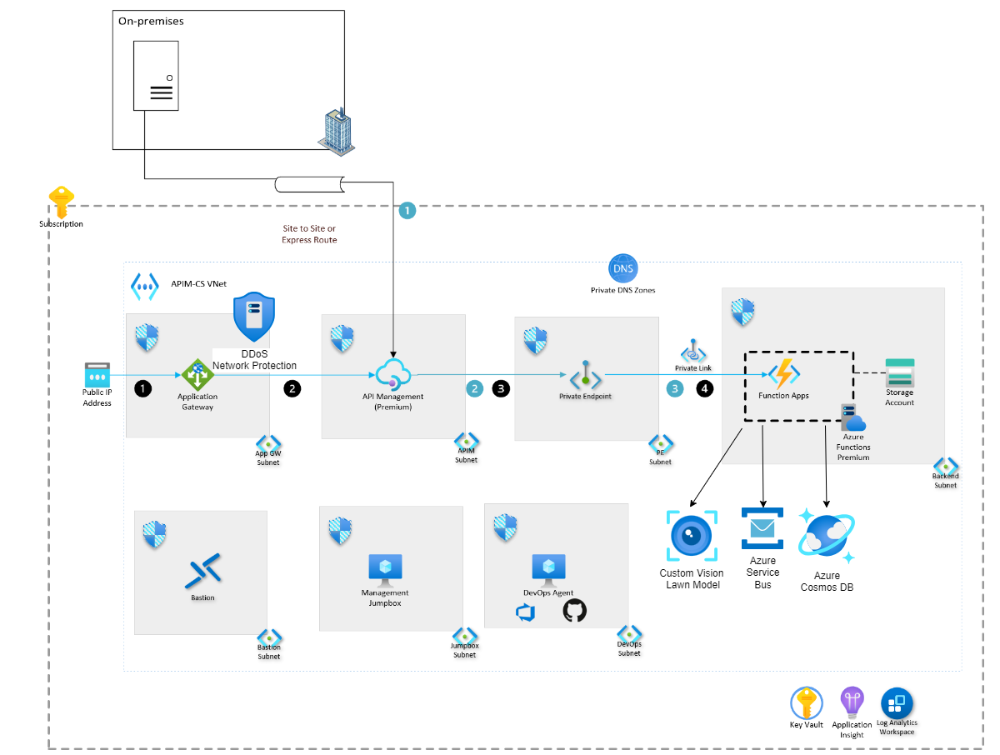
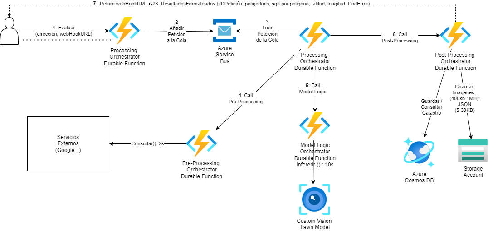

# Turing Challinge: Computer Vision
Pietro Romano

# Introducción
Este documento proporciona un resumen de enfoque de arquitectura basada en la información proporcionada para este ejercicio.
El diagrama de secuencia inicial se encuentra a continuación:

# Infraestructura
La estrategia general en cuanto a infraestructura se basa en el [Azure API Management landing zone accelerator](https://learn.microsoft.com/en-us/azure/architecture/example-scenario/integration/app-gateway-internal-api-management-function), como se muestra a continuación:

Los componentes clave de la arquitectura incluyen:
- **Application Gateway** actua como "Web Application Firewall": proporciona balanceo de carga a nivel 7, SSL offload y otras capacidades. Para protección DDoS, se recomienda proteger el VNet con [DDoS Network Protection](https://learn.microsoft.com/en-us/azure/application-gateway/tutorial-protect-application-gateway-ddos)
- **API Management** permite cuotas y otras políticas. 
- **Azure Functions**: Se propone usar [Durable Functions](https://learn.microsoft.com/en-us/azure/azure-functions/durable/durable-functions-overview?) para modelar el procesamiento. Las APIs están hosteados en Azure Functions y se mantienen internas, accceibles solo por "Private Endpoints". App Gateway requiere certificados PFX para terminación SSL. Azure functions permiten escalar automáticamente, se debe analizar qué tipo de hosting plan sea el más adecuado, por ejemplo el [Premium Plan](https://learn.microsoft.com/en-us/azure/azure-functions/functions-premium-plan).
- **Log Analytics** de **Azure Monitor** permite editar y ejecutar consultas de registro con datos de los registros de Azure Monitor, opcionalmente desde Azure Portal.
  - Se crearán alertas para degradación de servicio
  - Se creará una incidencia en JIRA si la prueba periódica end-to-end no sale correctamente
- **Application Insights** de Azure Monitor ayuda detectar anomalías, diagnosticar problemas y comprender los patrones de uso. Se usará para obtener trazabilidad end-to-end para las peticiones recibidas por ID de petición.
- **Azure Bastion** proporciona conectividad RDP/SSH segura a las máquinas virtuales de los desarrolladores desde Azure Portal mediante TLS. Con Azure Bastion, las máquinas virtuales ya no requieren una dirección IP pública para conectarse mediante RDP/SSH. Esta arquitectura de referencia usa Azure Bastion para acceder al servidor del agente de DevOps o del ejecutor de GitHub, o al servidor jumpbox de administración.
- **Azure Key Vault** es un servicio en la nube que almacena y accede de forma segura a los secretos, que van desde claves y contraseñas de API hasta certificados y claves criptográficas. Esta arquitectura de referencia usa Azure Key Vault para almacenar los certificados SSL que usa la instancia de Application Gateway.
- **Cosmos DB** : se propone como base de datos para los catastros (unos 150M): altamente escalable y flexible en cuanto a esquema.

# Procesamiento
Dado que el procesamiento debe poder escarlarse mucho y puede tardar unos 20 segundos, la petición inicial a la API solo devuelve un ID de petición inicialmente. El usuario del API debe también proporcionar un webhook URL al cual el servicio llamará con los resultados finales. La petición se añade a una cola de Azure Service Bus y es recogida por la función de procesamiento.
El flujo a alto nivel se muestra a continuación:
.

# Despliegue Continuo:
El un pipeline de CI/CD utilizará agentes Azure DevOps para la aplicación .NET., en un subnet privado para mayor seguridad.
Se recomienda el uso de herramientas de análisis de código como Mend Bolt, Sonar Cube etc. para asegurar la seguridad del código.
Para acceso a los reposistorios, se recomienda usar Git Credential Managers, utilizandolas mismas credenciales que para el portal de Azure DevOps Services, y soportan autenticación multi-factor.
Hat varios métodos de mantener información secreta en las pipelines:
- Si son necesarias variables secretas como contraseñas, identificadores y otros datos de identificación, se recomienda establecer variables secretas con **Azure Key Vault**.
- Los **archivos seguros** son una manera de almacenar archivos que puede usar en canalizaciones sin tener que incluirlos en el repositorio.
- GitHub [escanea repositorios](https://docs.github.com/es/code-security/secret-scanning/introduction/about-secret-scanning) para encontrar tipos conocidos de secretos.
- Para reutilizar código entre equipos y dministrar dependencias, se recomienda usar [Azure Artifacts](https://learn.microsoft.com/es-es/azure/devops/artifacts/start-using-azure-artifacts?view=azure-devops&tabs=nuget%2Cnugetserver).

Publique paquetes para fuentes y compártalos en equipos

# Costes:
Para la estimación de costes, se  han contado con las cifras de unas 2M de peticiones al año. Se h a realizado una estimación muy aproximada de unas 5.500€ mensuales. Ver la hoja [ExportedEstimate](./docs/ExportedEstimate.xlsx "") para más detalles.
La cifra exacta dependerá de muchos factores:
- Número y tamaño de instancias para Azure Functions (cores, RAM, storage)
- RUs requeridos para Cosmos DB: consultas, inserciones etc.
- Almacenamiento de Blobs: tamaño y patrones de uso
- Service Bus: número de mensajes (aunque no se espera que sea decisivo)

Para optimizar costes, debe haber reglas de autoscale tanto de scale-out como scale-in. También se debe considerar el uso de Reserved Instances una vez conocidas los requisitos reales.
  
# Próximos Pasos
Se recomienda:
- iterar sobre el diseño e implementar un prototipo con los componentes principales. 
- También profundizar en los requisitos "no funcionales" - un ejemplo se encuentra en la página [Quality Requirements](./docs/quality_requirements.md).